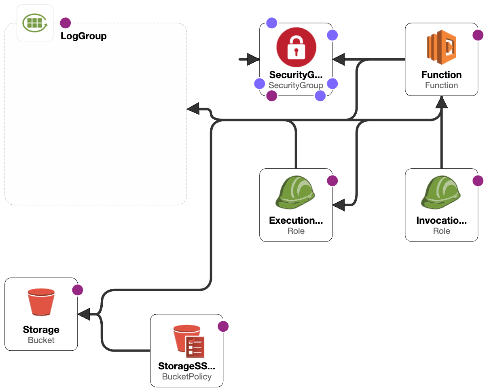

# Monte Carlo IaC Resources

Publicly available templates and other resources to assist customers with onboarding and using the platform.

## Templates

### CloudFormation

#### Monte Carlo's agent template for customer-hosted deployments in AWS ([Source](templates/cloudformation/aws_apollo_agent.yaml))

This template deploys Monte Carlo's [containerized agent](https://hub.docker.com/r/montecarlodata/agent) (Beta) on AWS
Lambda, along with storage, and roles:



See [here](https://docs.getmontecarlo.com/docs/platform-architecture) for platform details
and [here](https://docs.getmontecarlo.com/docs/create-and-register-an-aws-agent) for how to create and register an agent
on AWS.

For any developers of the agent [this](examples/agent/test_execution.sh) simple script can be handy in testing basic
execution of the agent.

#### Basic VPC ([Source](templates/cloudformation/basic_vpc.yaml))

This template creates a VPC with 2 public and private subnets. Includes a NAT, IGW, and S3 VPCE.
Can be used to connect an Agent to a VPC for peering and/or IP whitelisting.

The following example demonstrates how you can deploy an agent with this connected VPC in one stack:

```yaml
AWSTemplateFormatVersion: '2010-09-09'
Description: Example template that deploys an agent with a connected VPC by leveraging nested stacks.
Parameters:
  CloudAccountId:
    Description: >
      Select the Monte Carlo account your collection service is hosted in. This can be found in the 
      'settings/integrations/collectors' tab on the UI or via the 'montecarlo collectors list' command on the CLI.
    Type: String
    Default: 190812797848
    AllowedValues: [ 190812797848, 799135046351, 682816785079 ]
  ConcurrentExecutions:
    Default: 20
    Description: The number of concurrent lambda executions for the agent.
    MaxValue: 200
    MinValue: 0
    Type: Number
  ImageUri:
    Default: 752656882040.dkr.ecr.*.amazonaws.com/mcd-agent:latest
    Description: >
      URI of the Agent container image (ECR Repo). Note that the region automatically maps to where this stack 
      is deployed in.
    Type: String
  MemorySize:
    Default: 512
    Description: >
      The amount of memory (MB) available to the agent at runtime; this value can be any multiple of 
      1 MB greater than 256MB.
    MinValue: 256
    MaxValue: 10240
    Type: Number
Outputs:
  FunctionArn:
    Description: Agent Function ARN. To be used in registering.
    Value: !GetAtt Agent.Outputs.FunctionArn
  InvocationRoleArn:
    Description: Assumable role ARN. To be used in registering.
    Value: !GetAtt Agent.Outputs.InvocationRoleArn
  InvocationRoleExternalId:
    Description: Assumable role External ID. To be used in registering.
    Value: !GetAtt Agent.Outputs.InvocationRoleExternalId
  PublicIP:
    Description: IP address from which agent resources access the Internet (e.g. for IP whitelisting).
    Value: !GetAtt Networking.Outputs.PublicIP
Resources:
  Networking:
    Type: AWS::CloudFormation::Stack
    Properties:
      TemplateURL: https://mcd-public-resources.s3.amazonaws.com/cloudformation/basic_vpc.yaml
  Agent:
    Type: AWS::CloudFormation::Stack
    Properties:
      TemplateURL: https://mcd-public-resources.s3.amazonaws.com/cloudformation/aws_apollo_agent.yaml
      Parameters:
        CloudAccountId: !Ref CloudAccountId
        ConcurrentExecutions: !Ref ConcurrentExecutions
        ExistingVpcId: !GetAtt Networking.Outputs.VpcId
        ExistingSubnetIds: !Join [ ',', [ !GetAtt Networking.Outputs.PrivateSubnetAz1, !GetAtt Networking.Outputs.PrivateSubnetAz2 ] ]
        ImageUri: !Ref ImageUri
        MemorySize: !Ref MemorySize
```

### Terraform

Coming soon!

## Development

### CloudFormation

1. Install the [AWS CLI](https://docs.aws.amazon.com/cli/latest/userguide/getting-started-install.html)
2. Install any dependencies and pre-commit hooks
    ```
    pyenv activate mcd-iac-resources
    pip install -r requirements-dev.txt; pre-commit install
    ```
   This hook will lint all templates in the `templates/` directory
   using [cfn-lint](https://github.com/aws-cloudformation/cfn-lint). CircleCI will also validate templates.

Then any IaC templates can be created using commands
like [deploy](https://awscli.amazonaws.com/v2/documentation/api/latest/reference/cloudformation/deploy/index.html) or
the console.

After merging to `dev` CircleCI will publish any templates or resources in the `templates/` directory
to `s3://mcd-dev-public-resources`.

Note that any templates in this bucket are considered experimental and not intended for production use.

### Terraform

Coming soon!

## Releases

After merging to `main` CircleCI will publish any templates or resources in the `templates/` directory
to `s3://mcd-public-resources` (requires review, validation, and approval).

## Additional Resources

| **Description**                                                   | **Link**                                                       |
|-------------------------------------------------------------------|----------------------------------------------------------------|
| Monte Carlo's containerized agent                                 | https://github.com/monte-carlo-data/apollo-agent               |
| Monte Carlo's agent module for customer-hosted deployments in GCP | https://github.com/monte-carlo-data/terraform-google-mcd-agent |

## License

See [LICENSE](LICENSE) for more information.

## Security

See [SECURITY](SECURITY.md) for more information.